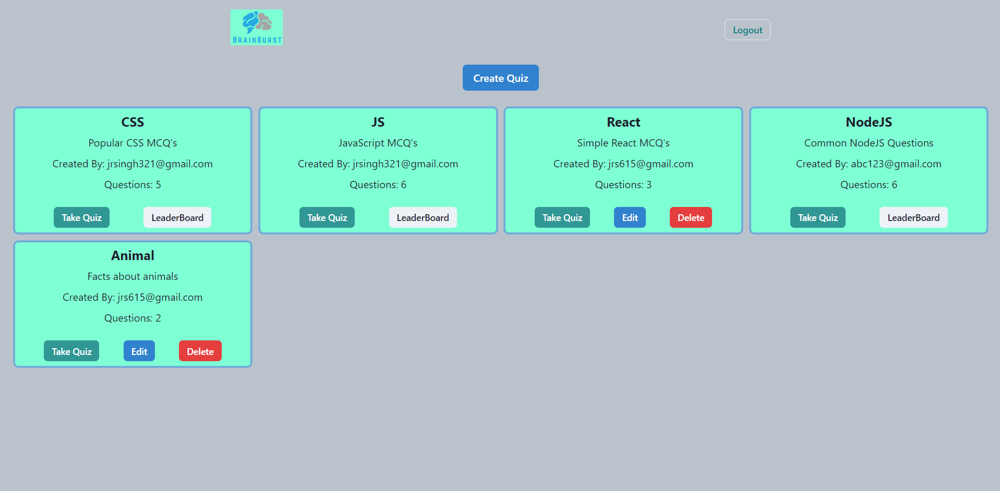
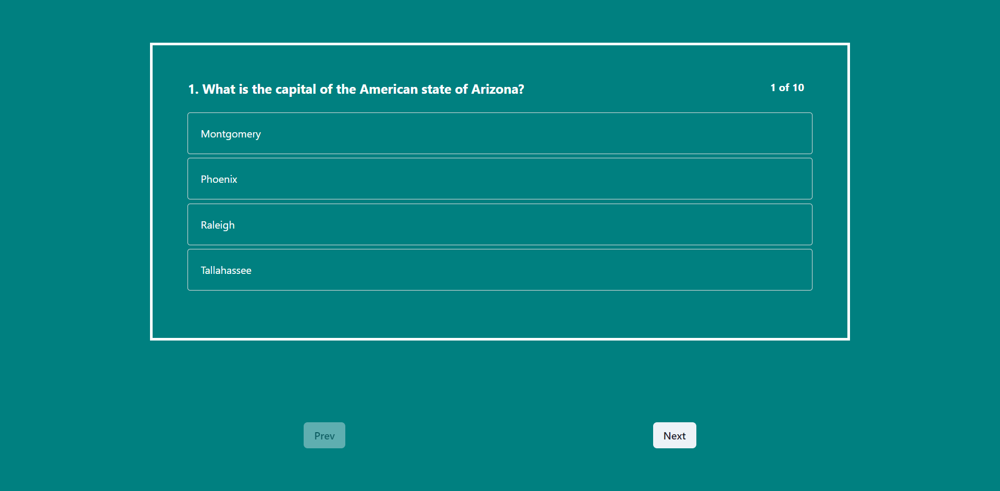
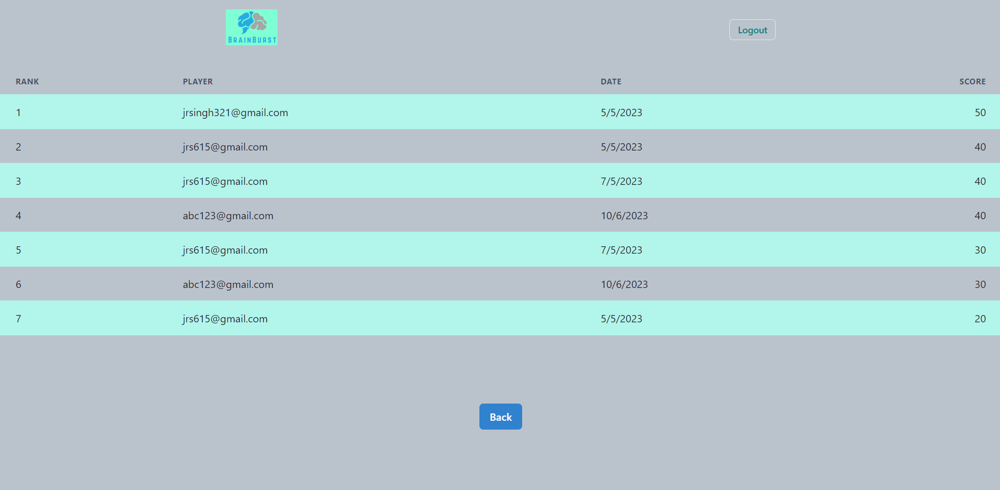
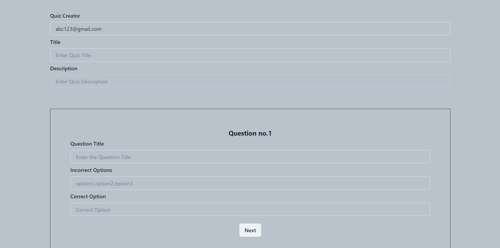
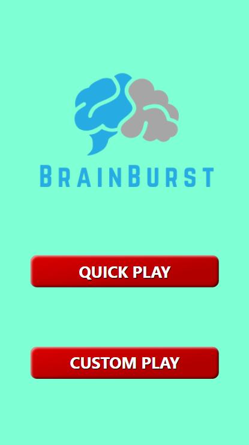
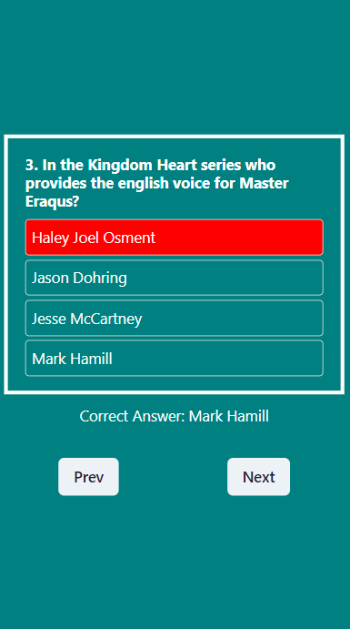
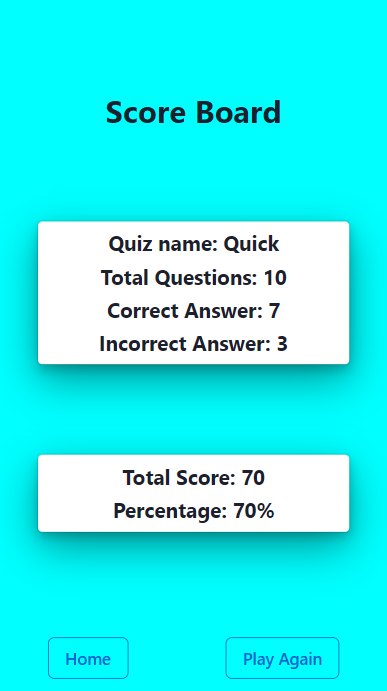

# Brain Bender 
A Quiz Game Application.

# How it works
<ul>
  <li>Two modes-Quick Play & Custom Play </li>
  <ol>Quick Play: 10 random Questions from different areas (No need to authenticate)</ol>
  <ol>Custom Play: Create & Play your own quiz (Needs authentication using email & password)</ol>
  <li>Player can create their own customised quiz having any number of questions</li>
  <li>LeaderBoard for each quizes</li>
</ul>

# App Logo

# Tech-functionality
<ol>
  <li>Session Storage: Storing of all the local data</li>
  <li>Bycrypt: Used for Hashing the password at Backend</li>
  <li>JsonWebToken: used for seemless authorisation</li>
  <li>Player can delete and Edit only their own quizes from dashboard</li>
  <li>Edit: It pre-fills the input fileld, player just need to make the alteration and save it</li>
  <li>Handling of wrong URL</li>
  <li>Fully Responsive for all screen sizes</li>
</ol>

# Snippets

### Small Screen

# Related Links

Backend Repo: <a href="https://github.com/jagroshansingh/BrainBurstQuiz_Backend">https://github.com/jagroshansingh/BrainBurstQuiz_Backend</a>

Backend Deployed: <a href="https://drab-blue-indri-sock.cyclic.app">https://drab-blue-indri-sock.cyclic.app</a>

